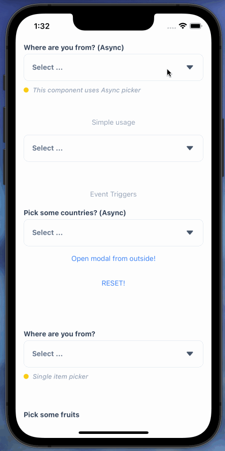
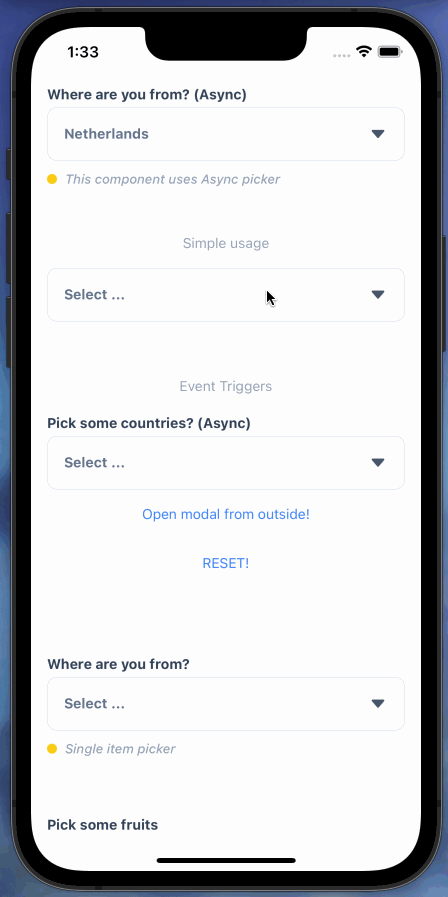
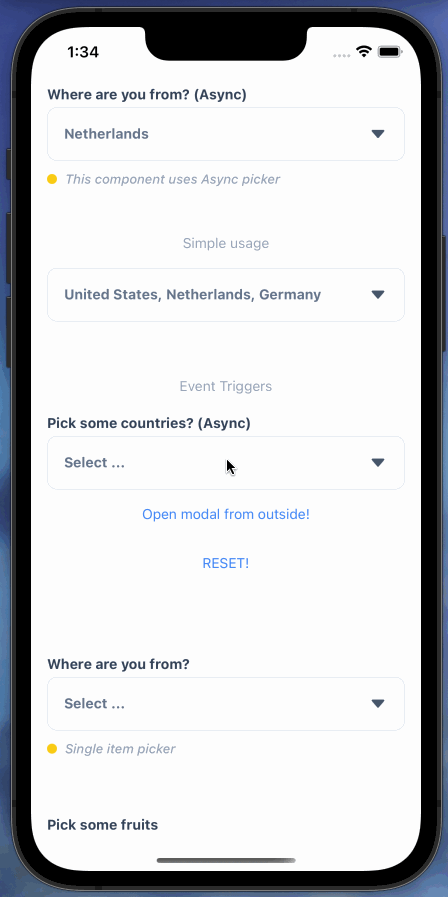

# React Native Async Picker

A powerful picker for React-Native

|                           Async Picker                            |                           Simple Picker                           | Event Trigger                                                     |
| :---------------------------------------------------------------: | :---------------------------------------------------------------: | ----------------------------------------------------------------- |
|  |  |  |

## Installation

```sh
yarn add react-native-async-picker
```

or

```sh
npm install react-native-async-picker
```

## Usage

### Simple Usage

```ts
import AsyncPicker, { PickerItem } from 'react-native-async-picker';

const countries = [
  { name: 'United States', code: 'US' },
  { name: 'United Kingdom', code: 'GB' },
  { name: 'Netherlands', code: 'NL' },
  { name: 'Germany', code: 'DE' },
];

const [selectedItems, setSelectedItems] = useState([]);

<AsyncPicker
  data={countries} // Array
  value={selectedItems} // Array
  onChange={setSelectedItems}
  keyExtractor={(e) => e.code}
  labelExtractor={(e) => e.name}
/>;
```

[Source on Github](example/src/samples/PickSomeFruits.tsx)

---

### Async Search - Typescript

```ts
import React, { useEffect, useState } from 'react';
import AsyncPicker, { PickerItem, helpers } from 'react-native-async-picker';
import allCountries from './mocks/countries.json';

type ItemProps = {
  name: string;
  code: string;
};

const PickYourAsyncCountry = () => {
  const [data, setData] = useState<ItemProps[]>([]);
  const [selectedItems, setSelectedItems] = useState<ItemProps[]>([]);

  const [query, setQuery] = useState('');
  const [isLoading, setIsLoading] = useState(false);

  const search = async (q: string, allData: ItemProps[]) => {
    setIsLoading(true);
    const result = allData.filter((el) =>
      helpers.isTextIncludedInString(q, el.name)
    );

    await helpers.sleep(500);
    setData(result || []);
    setIsLoading(false);
  };

  useEffect(() => {
    search(query, allCountries);
  }, [query]);

  return (
    <AsyncPicker
      label="Where are you from? (Async)"
      value={selectedItems}
      onChange={setSelectedItems}
      data={data}
      limit={1}
      closeOnSelect
      isLoading={isLoading}
      searchProps={{
        value: query,
        onChangeText: setQuery,
      }}
      keyExtractor={(e) => e.code}
      labelExtractor={(e) => e.name}
      searchStringExtractor={(el) => `${el.name} - ${el.code}`}
      renderItem={({ item, isDisabled, isActive, onItemPress }) => (
        <PickerItem
          asRadio
          label={item.name}
          isActive={isActive}
          disabled={isDisabled}
          onPress={() => {
            onItemPress(item);
          }}
        />
      )}
    />
  );
};

export default PickYourAsyncCountry;
```

[Source on Github](example/src/samples/PickSomeFruits.tsx)

[Countries as JSON](example/src/mocks/countries.json)

---

### Simple array - TypeScript

```tsx
import React, { useState } from 'react';
import AsyncPicker, { PickerItem, helpers } from 'react-native-async-picker';

const fruits = [
  'apple',
  'cherry',
  'cloudberry',
  'coconut',
  'tomato',
  'ugli fruit',
  'watermelon',
];

const PickSomeFruits = () => {
  const [selectedItems, setSelectedItems] = useState<string[]>([]);

  return (
    <AsyncPicker
      label="Pick some fruits"
      value={selectedItems}
      onChange={setSelectedItems}
      data={fruits}
      limit={3}
      keyExtractor={(item) => item}
      isSearchable={false}
      labelExtractor={(item) => helpers.capitalizeFirstLetter(item)}
    />
  );
};

export default PickSomeFruits;
```

### Array of objects

```ts
import React, { useEffect, useState } from 'react';
import AsyncPicker, { PickerItem } from 'react-native-async-picker';
import allCountries from './mocks/countries.json';

type ItemProps = {
  name: string;
  code: string;
};

const PickYourCountry = () => {
  const [data, setData] = useState<ItemProps[]>([]);
  const [selectedItems, setSelectedItems] = useState<ItemProps[]>([]);

  useEffect(() => {
    setData(allCountries);
  }, []);

  return (
    <AsyncPicker
      label="Where are you from?"
      value={selectedItems}
      onChange={setSelectedItems}
      data={data}
      limit={1}
      closeOnSelect
      keyExtractor={(e) => e.code}
      labelExtractor={(e) => e.name}
      searchStringExtractor={(el) => `${el.name} - ${el.code}`}
    />
  );
};

export default PickYourCountry;
```

## Required Props

```ts
<AsyncPicker
  data={[]} // Array
  value={values} // Always is Array
  onChange={(el) => setValues(el)} // Always returns an Array
  keyExtractor={(item) => item.code} // Option Key
  labelExtractor={(item) => item.name} // Option Label - Mostly Use to search
/>
```

### Optional configs

```ts
<AsyncPicker
  {...RequiredProps}
  label="Where are you from?"
  limit={1} // Use 0 for infinite number. Default is 0
  closeOnSelect // Good for single items. Set limit prop to 1
  modalProps={{
    animationType: 'slide',
    // All props: https://reactnative.dev/docs/modal
  }}
  headerProps={
    left: JSX
    right: JSX
    label: string | JSX
  }
  statusBarProps={
    // Extends StatusBar props - https://reactnative.dev/docs/statusbar
  }
  isSearchable={true} // Shows search bar in modal
  searchProps={
    // Extends TextInput props - https://reactnative.dev/docs/textinput
  }
  onClose={() => {}} // Calls on close modal
  isLoading={true} // Trigger loading status
  renderButton={({openModal, value}) => JSX} // Render custom button
  defaultButtonProps={{
    placeholder: string | JSX, // default is 'Select ...'
    caretIcon: JSX
  }}
  renderItem={({item, isActive, isDisabled, onItemPress}) => {
    return <PickerItem
        asRadio={false} // Render icon as radio button
        label={item.name}
        isActive={isActive}
        disabled={isDisabled}
        onPress={() => {
          onItemPress(item);
        }}
      />

  }}
/>
```

## Tricks

### Ref and Events

```tsx
import AsyncPicker, { AsyncPickerRef } from 'react-native-async-picker';

const ref = React.useRef<AsyncPickerRef<ItemProps>>(null);

const Events = () => {
  ref.current?.openModal(); // Open Modal
  ref.current?.closeModal(); // Close Modal
  ref.current?.reset(); // Reset value
  ref.current?.focusOnSearch(); // Focus on search input
  ref.current?.getLocalSearchQuery(); // Get local input value
  ref.current?.triggerOptionPress(item); // Trigger press on option with value
};

<AsyncPicker ref={ref} {...otherProps} />;
```

### Custom empty result

```tsx
<AsyncPicker
  {...props}
  ListEmptyComponent={
    <View style={{ flex: 1, justifyContent: 'center', alignItems: 'center' }}>
      {!searchQuery && (
        <>
          <Image source={require('')} style={{ width: 128, height: 128 }} />
          <Text>Search something ...</Text>
        </>
      )}

      {!!searchQuery && !isLoading && (
        <>
          <Image source={require('')} style={{ width: 256, height: 256 }} />
          <Text>No results</Text>
        </>
      )}
    </View>
  }
/>
```

### Pause searching white user is typing

```tsx
useEffect(() => {
  const delayFunc = setTimeout(() => {
    search(query); // Runs this function after 500ms
  }, 500); // Modify this number to await longer after user stops typing

  return () => clearTimeout(delayFunc);
}, [query]);
```

### Custom item component

```tsx
import { PickerItem } from 'react-native-async-picker';

<AsyncPicker
  {...props}
  renderItem={({
    item,
    index,
    isActive,
    disabled,
    closeModal, // Call this function to open modal
    onItemPress, // Call this function onPress with item property
  }) => {
    // Use any component that you want
    return (
      <PickerItem
        label={labelExtractor(item)}
        isActive={isActive}
        disabled={disabled}
        onPress={() => onOptionPress(item)}
      />
    );
  }}
/>;
```

## Contributing

See the [contributing guide](CONTRIBUTING.md) to learn how to contribute to the repository and the development workflow.

## License

MIT
